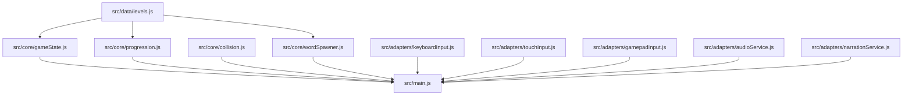

# Modules

Cette page explique le rôle des modules les plus importants.

## `levels.js`

Contient les données pédagogiques.
Il doit rester indépendant du moteur.

Pourquoi :

- éviter de mélanger contenu et règles
- permettre des tests de structure
- faciliter l’ajout de nouveaux niveaux

## `gameState.js`

Contient la création et la réinitialisation de l’état de partie.

Pourquoi :

- garder les transitions de statut testables
- éviter les effets de bord dispersés

## `collision.js`

Contient la détection de collision entre l’épée et les mots.

Pourquoi :

- la géométrie peut être testée sans DOM réel
- la logique de frappe doit rester stable

## `gamepadInput.js`

Normalise la manette.

Pourquoi :

- support SNES USB
- support des mappings standards
- évite la lecture directe dans la boucle de jeu

## `audioService.js`

Encapsule le WebAudio pour les petits sons.

Pourquoi :

- le jeu reste jouable si l’API manque
- les sons restent centralisés

## `narrationService.js`

Encapsule `speechSynthesis` comme option.

Pourquoi :

- Brave peut exposer une API instable ou vide
- le jeu doit continuer sans narration

## Vue des dépendances

