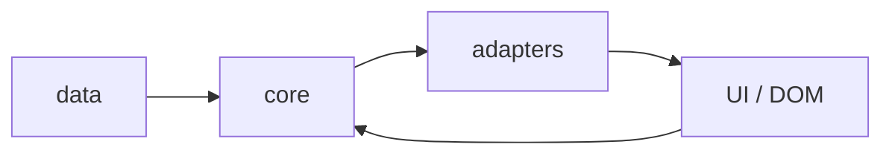

# Architecture actuelle

Le projet est une application Vanilla JS servie par Vite.
Le rendu final est une page HTML statique pour le jeu et un site MkDocs pour la documentation.

## État actuel

- `src/data/levels.js` contient les niveaux;
- `src/core/` contient la logique testable;
- `src/adapters/` contient les interfaces navigateur;
- `src/main.js` connecte tout au DOM;
- la documentation est versionnée dans `docs/`.

## Architecture cible

`dsn~cdm.runtime-flow~1`

Le projet doit suivre ce flux:

Needs: impl, utest

## Ce que cela garantit

- on peut changer les niveaux sans casser le moteur;
- on peut tester le core sans navigateur;
- on peut faire échouer une API optionnelle sans casser la partie;
- on peut lire la doc en parallèle du code.

