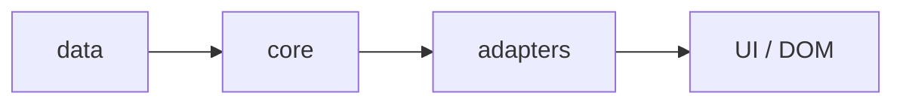

# Architecture actuelle

Le projet est une application Vanilla JS servie par Vite.

## Organisation actuelle

- `src/data/levels.js` contient les données pédagogiques
- `src/core/` contient la logique pure testable
- `src/adapters/` contient les interfaces vers le navigateur
- `src/main.js` relie le DOM, les services et la boucle de jeu

## Pourquoi cette structure

Elle permet de modifier un domaine sans casser les autres :

- changer les niveaux sans toucher au moteur
- tester la collision sans ouvrir le navigateur
- remplacer une API navigateur par un adaptateur

## État cible

Le projet cible une architecture à quatre couches :

