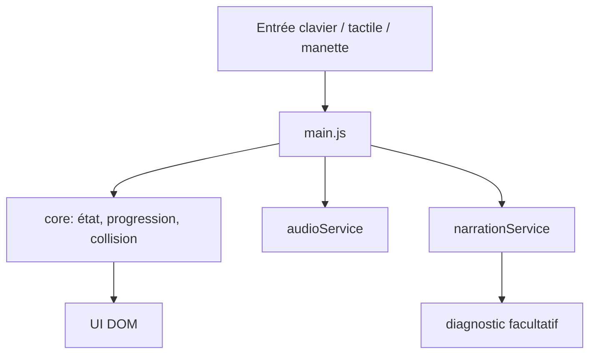

# Flux runtime

Cette page décrit le chemin d’une action du joueur jusqu’au rendu.

## Flux principal

## Séquence d’une frappe

1. le joueur déclenche une action
2. l’adaptateur produit un état uniforme
3. `main.js` appelle la logique de collision
4. le jeu met à jour l’état
5. le jeu affiche le texte
6. le service audio joue le son
7. le service narration peut parler si disponible

## Points de stabilité

- pas d’accès direct à `speechSynthesis` depuis le core
- pas d’accès direct à `AudioContext` depuis le core
- pas de lecture directe de `navigator.getGamepads()` dans la boucle principale

